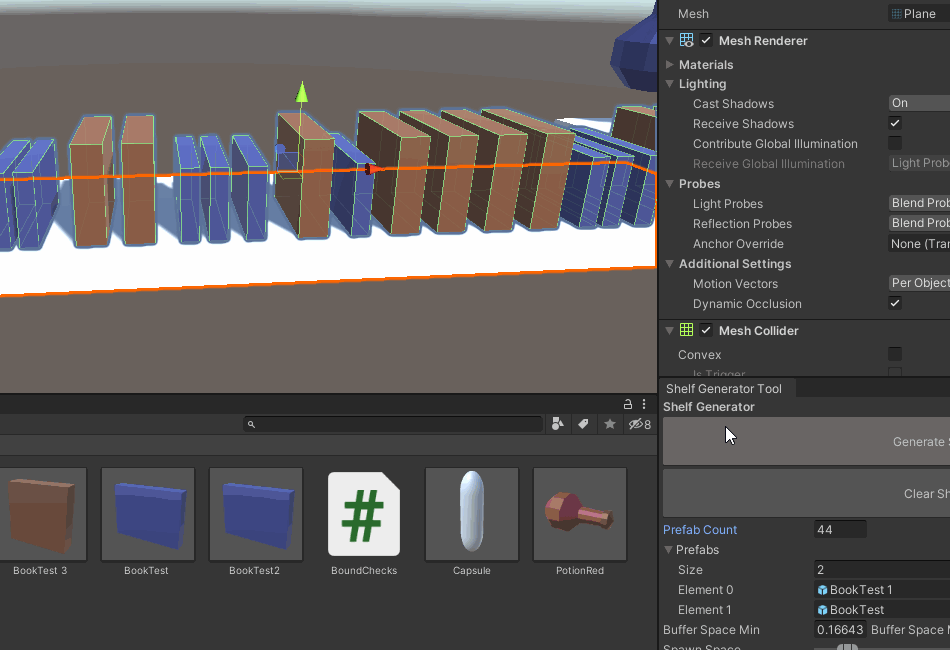

# ShelfGeneratorToolUnity
This is a simple tool to help generate shelf's in a 3D game with bottles, books, weapons, 
and more this is an in-editor tool that is easy to use and saves time placing meshes/prefabs.

message me here: frozenwispstudios@gmail.com for more details thanks
Also follow me here on 

Twitter: https://twitter.com/_frozenwisp_

Instagram: https://www.instagram.com/frozenwispstudios/

Github: https://github.com/frozenwispstudios

Gitlab: https://gitlab.com/frozenwispstudios

Itch.io: https://frozenwipstudios.itch.io/

Linkedin: https://www.linkedin.com/in/ben-mcneill-144608188/

